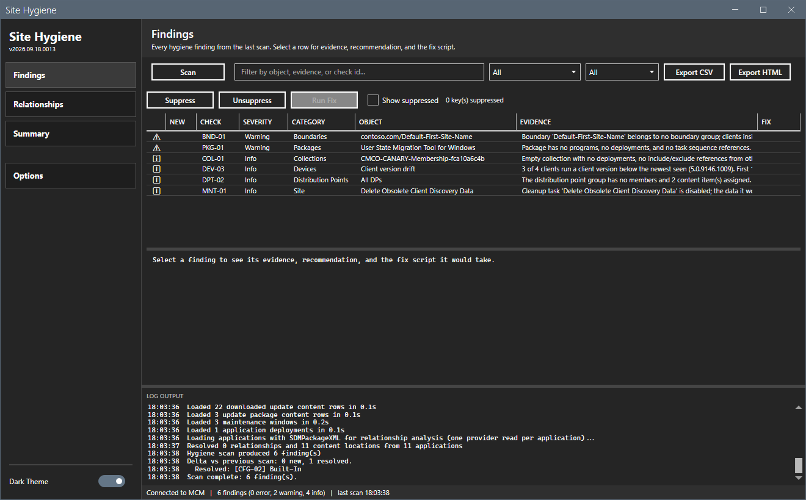

# Site Hygiene

[](https://github.com/jasonulbright/site-hygiene/releases/latest)
[](https://github.com/jasonulbright/site-hygiene/releases)
[](#requirements)
[](LICENSE)

A scanner, repair tool, and live monitor for Configuration Manager
sites. A scan finds clutter and drift: unused applications and packages,
dead collections, stale and failing deployments, broken application
relationships. A scan is read-only. Every finding carries the evidence
that produced it and the exact PowerShell a fix would run. The tool runs
a fix script only when you select the finding, click **Run Fix**, and
confirm the script in a dialog. Many findings carry guidance only; the
tool never runs those.

The Live views show current deployment, content, distribution point,
client, and site status on demand and on a timer, with per-metric
history and threshold alerts. They create no findings and change
nothing.

Site Hygiene replaces two earlier suite tools. The Supersedence and
Dependency Auditor's relationship inventory and trees live on the
Relationships view. The ConfigMgr Health Dashboard's views live in the
Live group, and a retired dashboard install's settings and history are
imported on first launch (see [Live views](#live-views)).



## Requirements

- Windows 10 / 11 or Server 2016+
- PowerShell 5.1
- .NET Framework 4.7.2+
- Configuration Manager console installed (provides the
  `ConfigurationManager` PowerShell module)
- Read access to the SMS Provider for a scan (a scan never mutates the
  site). **Run Fix** needs the Configuration Manager rights that the fix
  script itself needs.
- Optional: the `SqlServer` PowerShell module (`Invoke-Sqlcmd`) and read
  access to the `CM_<site>` database for the Client Health and Inactive
  Devices views. Leave SQL Server blank in Options to skip them.

## Quick Start

1. Download the release zip and extract it to a working folder.
2. Right-click `start-sitehygiene.ps1` -> **Run with PowerShell**, or from
   a PowerShell prompt:

   ```powershell
   powershell -ExecutionPolicy Bypass -File start-sitehygiene.ps1
   ```
3. Click **Options** on the sidebar and set Site Code and SMS Provider.
   Set SQL Server too if you want the two SQL-backed Live views.
4. Optional: under **Options > Scan**, clear the areas you do not need.
   On a large site, leave the three areas marked slow for a separate
   run. A pause between provider calls, in milliseconds, spaces the scan
   queries out on a busy SMS Provider; the default is 0.
5. Click **Scan** on a Scan view, or **Refresh All** on a Live view.
   **Cancel** on the progress overlay stops either one.

## Checks

Stable check IDs so findings and reports stay comparable across scans:

| Id | Severity | Finds |
|---|---|---|
| APP-01 | Warning | Applications with no deployments, no task sequence references, no supersedence role, and no dependency targeting (with an age grace window for new apps) |
| APP-02 | Error | Retired (expired) applications that still have active deployments |
| APP-03 | Warning | Superseded applications whose own deployments are still active |
| APP-05 | Info | Applications that hold revisions other than the current one; the fix deletes the old revisions |
| PKG-01 | Warning | Legacy packages with no programs, no deployments, and no task sequence references |
| CNT-01 | Warning | Content that failed on one or more distribution points, with the failed/targeted counts |
| CNT-02 | Info | Content still distributing more than two days after its last update |
| CNT-03 | Error | Deployed applications and packages with source files but no targeted distribution point |
| COL-01 | Info | Empty collections nothing references: no deployments, no include/exclude rules from other collections, not a limiting parent, no collection variables |
| COL-02 | Warning | Deployments targeting a collection with zero members |
| COL-03 | Warning | Incremental-evaluation collection count over the recommended ceiling |
| COL-04 | Warning | Collections whose last full or incremental evaluation ran longer than five seconds, slowest first (site version 2010 or later) |
| DPL-01 | Info | Application deployments past their expiration time |
| DPL-02 | Error | Required deployments past deadline with a failure rate over threshold |
| DPL-03 | Info | Available deployments old enough to judge with zero installs and nothing in progress |
| DPL-04 | Warning | Required deployments that target All Systems, All Desktop and Server Clients, All Users, All User Groups, or All Users and User Groups |
| DPL-05 | Warning | Deployments of a disabled task sequence or a disabled program |
| COL-10 | Info | One-time maintenance windows that ended in the past |
| APP-04 | Warning/Info | Deployment-type content sources missing or unreachable, with timed-out probes reported as Unknown at Info |
| SUP-01 | Error | Supersedence referencing a deleted application |
| SUP-02 | Error | Circular supersedence chain |
| SUP-03 | Warning | Superseding application disabled |
| SUP-04 | Warning | Supersedence target retired or expired |
| DEP-01 | Error | Dependency referencing a deleted application |
| DEP-02 | Error | Circular dependency |
| DEP-03 | Warning | Dependency target disabled |
| DEP-04 | Warning | Dependency target retired or expired |
| DEP-05 | Info | Dependency target reports no packaged content; contentless script deployment types may be intentional |
| REL-01 | Info | Relationship participants without manufacturer metadata |
| DEV-01 | Warning/Info | Inactive clients beyond threshold (Info when cleanup tasks will purge them) |
| DEV-02 | Warning | Duplicate device records by name or SMBIOS GUID |
| DEV-03 | Info | Clients behind the newest client version |
| BND-01 | Warning | Boundary in no boundary group |
| BND-02 | Warning | Boundary group with no site systems |
| BND-03 | Info | Overlapping IP-range boundaries |
| TSQ-01 | Error | Task sequence referencing deleted content |
| TSQ-02 | Warning | Custom boot images / driver packages nothing references |
| TSQ-03 | Warning | Applications in a task sequence without the setting that lets a task sequence install them |
| TSQ-04 | Error | Applications in a task sequence with source files and content on no distribution point |
| UPD-01 | Warning | Update group over the documented expired-update ratio threshold; superseded presence is reported separately |
| UPD-03 | Error/Warning/Info | ADR erroring / stale / disabled |
| UPD-04 | Warning | Update groups over the limit of 1000 updates in one deployment |
| UPD-05 | Info | Deployment packages that still hold content for expired updates |
| DPT-01 | Warning | Distribution points in no boundary group |
| DPT-02 | Info | Distribution point groups with no members |
| CFG-01 | Info | Configuration baselines with no deployment and no referencing baseline |
| CFG-02 | Info | Configuration items no baseline references |
| CFG-03 | Info | Custom client settings deployed to no collection |
| DRV-01 | Info | Drivers in no driver package and no boot image |
| SEC-01 | Warning | Administrative users whose directory account the site reports as deleted |
| MNT-01 | Info | Recommended cleanup maintenance tasks disabled |
| MNT-02 | Warning | Backup Site Server task disabled |

The relationship families come from one additional bulk application pass
that parses each app's `SDMPackageXML` in-memory. `SDMPackageXML` is a
lazy provider property, so that pass costs one provider fetch per
application. The same pass answers the task sequence install setting
that TSQ-03 and TSQ-04 read, so those checks add no reads of their own
when the relationships area is in scope.

Thresholds (age windows, incremental ceiling, failure percentage) have
sensible defaults in `Get-HygieneDefaultThresholds`.

## How a scan works

One prefetch pass pulls the datasets the selected scan areas need. The
reads are bulk `Get-CM*` cmdlets and column-restricted WQL queries. All
reads use the console's provider connection under your Configuration
Manager role. The checks run as pure functions over that data. A dataset that fails
to load degrades to an empty set with a note in the Summary view instead
of killing the scan; the note also says which check may over- or
under-report because of it.

Every read runs one after another on one background thread; a scan
never sends two provider calls at the same time. Three areas cost one
SMS Provider read per object and are marked slow in the scope list.
**Application relationships and content paths** reads every application
definition. **Collection evaluation schedules** reads every custom
collection that has a full-update schedule. **Maintenance windows**
reads every collection that has collection settings. **Task sequences**
reads one application definition per application a task sequence
references, unless the relationships area is in scope, in which case
those definitions come from the relationship pass. Everything else is
one query per dataset. **Software update package content** runs three
queries; their row counts grow with the number of downloaded updates.
The optional pause in **Options > Scan** waits that many milliseconds
before every provider call after the first. Each dataset logs its row
count and duration to the log pane, the console window, and the log
file as it completes. A scoped scan leaves the rescan-delta baseline
unchanged.

## Views

- **Findings** — every finding from the last scan with severity glyphs,
  filterable by text, category, and severity. Selecting a row shows the
  full evidence, the recommendation, and the fix script; Run Fix
  executes that script against the site after confirmation, and a
  multi-row selection runs as a bulk fix behind one confirmation that
  lists every script. A New column flags findings first seen this scan;
  resolved findings are logged, with the comparison baseline kept in
  `SiteHygiene.lastscan.json`. Suppress and
  Unsuppress (multi-select) hide accepted findings from future scans;
  keys persist in `SiteHygiene.suppressions.json` and a toggle shows the
  suppressed set.
- **Relationships** — every supersedence and dependency relationship
  from the last scan. The **Inventory** tab lists each one, healthy rows
  included, with kind, status, a loop flag, source and target
  application and version, deployment type, dependency state, and
  supersedence chain depth; filter by kind, status, and text. Status
  follows the SUP/DEP check precedence; the loop flag is separate,
  because a circular edge can also have an expired or disabled end. The **Tree** tab shows
  supersedence chains and dependency trees with per-node health glyphs.
  Selecting a row or a node shows the application's standing.
- **Summary** — per-check counts plus dataset notes.

## Live views

The Live group reads current site status. **Refresh All** runs every
query; the auto-refresh timer repeats it at the interval set in
**Options > Live**. The timer arms after the first refresh of a session,
or at launch when the window last showed a Live view, so a scan-only
session never polls on its own. **Pause Auto-Refresh** holds it.

| View | Source |
|---|---|
| **Deployments** | `Get-CMDeployment`: every deployment with targeted, success, error, and in-progress counts |
| **Content** | `SMS_PackageStatusDistPointsSummarizer`: only content with a failed or in-progress distribution point |
| **Distribution Points** | `Get-CMDistributionPoint` plus `SMS_SiteSystemSummarizer` status |
| **Client Health** | SQL `v_CH_ClientSummary` joined to `v_R_System` |
| **Inactive Devices** | SQL, devices past the inactivity threshold set in Options |
| **Site Health** | `SMS_ComponentSummarizer` and `SMS_SiteSystemSummarizer` |
| **Trends** | `History\metrics-history.csv`: one row of counts per completed refresh, 180 days kept |

Status is a glyph in the first column: check for OK, warning sign for
warning or in progress, cross for failed or critical, ellipsis for
unknown. The status filter on the action bar keys off that glyph.

**Alerts** (Options > Alerts) fire when a metric crosses into breach on
a completed refresh: a critical site component or site system, a
critical distribution point, a failed DP-content pair, or overall
deployment compliance below the floor. Delivery is a Windows toast plus
a line in `Logs\SiteHygiene-alerts.log` and the log pane. An alert
repeats only after the metric recovers and breaches again.

A retired ConfigMgr Health Dashboard install is imported on launch from
`legacy\mecm-health-dashboard\` inside this folder (where the suite
installer keeps a retired install's json, history, logs, and reports,
beside a zip of the whole old folder) or from a sibling
`mecm-health-dashboard\` folder.
The import fills the SQL Server, refresh, threshold, and alert settings
the tool has no value for yet, and copies the metrics history when this
tool has none. It never moves or deletes the old files. The old window
state is not imported.

## Export

**Export CSV** and **Export HTML** write the active view's filtered rows.
On Findings the report carries evidence, recommendation, and fix script
per finding and the HTML color-codes severity. On Relationships and the
Live views the report is the grid as shown; on Trends it is the charted
series. **Copy Summary** on a Live view puts a plain-text rollup of the
last refresh on the clipboard. Files land under `Reports/` by default.

## Project Structure

```
site-hygiene/
+- start-sitehygiene.ps1                     # WPF shell
+- MainWindow.xaml                           # Main window layout
+- Lib/                                      # Vendored MahApps.Metro 2.4.10
|  \- SuiteCommon/                           # Vendored shared core: logging + CM connection
+- Module/
|  +- SiteHygieneCommon.psd1                 # Module manifest
|  +- SiteHygieneCommon.psm1                 # Check engine (data prefetch + pure checks + exports)
|  \- SiteHygieneLive.psm1                   # Live queries, metrics history, table export
+- History/                                  # metrics-history.csv, one row per completed refresh
+- Logs/                                     # Session logs (per-run) and SiteHygiene-alerts.log
+- Reports/                                  # CSV / HTML exports
+- CHANGELOG.md
+- LICENSE
\- README.md
```

Files the tool writes beside itself: `SiteHygiene.prefs.json` (site,
provider, SQL server, scan scope, pause, refresh, threshold, alerts),
`SiteHygiene.windowstate.json`, `SiteHygiene.suppressions.json`,
`SiteHygiene.lastscan.json`, `History\metrics-history.csv`, and the
`Logs\` and `Reports\` folders.

## Safety

- A scan is read-only end to end: `Get-CM*` cmdlets plus read-only WQL
  queries.
- Nothing mutates without Run Fix: a per-finding action behind a
  confirmation dialog that shows the exact script it will run. The
  script is logged before execution and the outcome after. Comment-only
  fix guidance never enables the action.
- The Live views are read-only: `Get-CM*` cmdlets, WMI summarizer
  classes, and `SELECT` statements against the site database.
- Scans, fixes, and refreshes run one at a time in a background runspace
  so the UI stays responsive on large sites.

## License

This project is licensed under the [MIT License](LICENSE).
